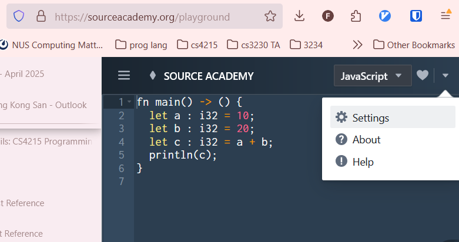
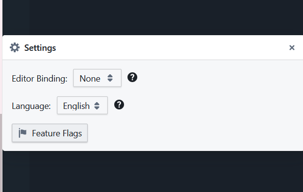
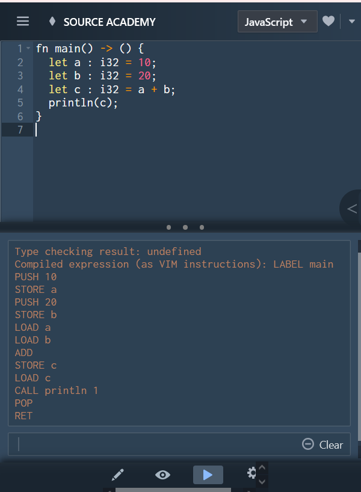

# rusted

(you are on branch: `main`)

## testing and running locally

**for the sake of reproducibility: DO NOT USE NPM! use yarn build/test instead.**

just run `yarn build`.

to run the tests in `tests/*`, do `yarn test`.

to execute a specific file (that may not use jest), do `node --experimental-transform-types path/to/your/file.ts`

## testing and running with source academy

upon pushing to the `filbert` branch, a github actions workflow is run to build and deploy the github pages
(can make changes in `.github/workflows/build-deploy.yml` in the `main` branch)

the task builds and hosts our package as a javascript file `index.js` that can be found at:
https://24-25s2-cs4215project.github.io/Rusted/index.js

then go to https://sourceacademy.org/playground
click the dropdown menu -> settings

go to feature flags

set `conductor.enable` to `true`
and `conductor.evaluator.url` to our github pages `index.js` url (see above)

now you can just paste your rust code into the sourceacademy playground (ignore the language settings) and run

